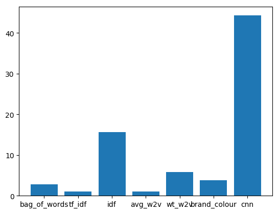
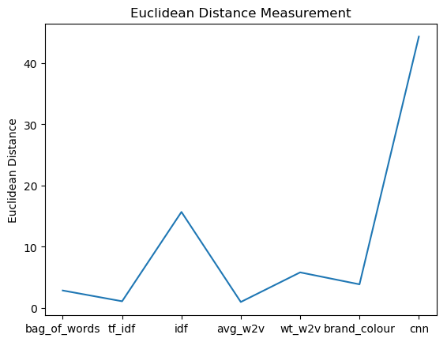

# Apparel-Recommendation

Extracts apparel details from amazon api and recommends similar products using nltk and keras


## DOMAIN BACKGROUND

Personalized product recommendations are the alternative way of navigating through the online shop. More people find products they need. Even if they didn’t think of them. Build a recommendation engine which suggests similar products to the given product in any e-commerce websites ex. Amazon.com, myntra.com etc.

In this project we are extracting the json file for over 180,000 apparels images and recommend similar apparels using content based search.

## PROBLEM STATEMENT

Given a json file for extracting the 180k apparel images from amazon.com we need to recommend the similar apparel based on the document id i.e product id and number of apparels to be recommended at a time.
Each of those images will be recommended based on following fields:
```
1. asin  ( Amazon standard identification number)

2. brand ( brand to which the product belongs to )

3. color ( Color information of apparel, it can contain many colors as   a value ex: red and black stripes ) 

4. product_type_name (type of the apperal, ex: SHIRT/TSHIRT )

5. medium_image_url  ( url of the image )

6. title (title of the product.)

7. formatted_price (price of the product)
```
We are going to use a total of `seven approaches` for recommending the apparel as following.

```
1.Bag of words model

2.tf-idf model

3.idf model

4.word2vec model

5.idf weighted word2vec model

6.weighted similarity using brand and color

7.visual features based using convolution neural networks
```

## DATASETS AND INPUTS

* **[tops_fashion.json](https://www.kaggle.com/ajaysh/women-apparel-recommendation-engine-amazoncom#tops_fashion.json)**

* [16k_apparel_preprocessed pickle file](https://drive.google.com/drive/u/1/folders/0BwNkduBnePt2VWhCYXhMV3p4dTg)

* [Trained Word2Vec Model](https://drive.google.com/drive/u/1/folders/0BwNkduBnePt2VWhCYXhMV3p4dTg)

* Trained CNN Model

	* [16k_data_featues_asins ](https://drive.google.com/drive/u/1/folders/0BwNkduBnePt2VWhCYXhMV3p4dTg)

	* [16k_data_cnn_featues.npy](https://drive.google.com/drive/u/1/folders/0BwNkduBnePt2VWhCYXhMV3p4dTg)

## Software Requirments

* Install 
	* [Anaconda](https://www.anaconda.com/download/#linux) with following extra packages
	* [tensorflow](https://www.tensorflow.org/)
	* [plotly](https://plot.ly/)
	* [PIL](https://pillow.readthedocs.io/en/5.2.x/)

* GPU for training the [Convolution neural networks model](https://en.wikipedia.org/wiki/Convolutional_neural_network) and [word2vec model](https://en.wikipedia.org/wiki/Word2vec).

## Execution and Running Code

* Open the terminal and clone this repository by exectuting git clone https://github.com/Abhinav1004/Apparel-Recommendation.git

* Run the jupyter notebook by jupyter notebook Apparel_Recommendation.ipynb

* Start executing the cells by Shift+Enter

## Observation

* We trained the seven models and recommended similar top 20 apparels with the least [euclidean distance](https://en.wikipedia.org/wiki/Euclidean_distance) for each model.

* We calculated the average euclidean distance for each model by taking the mean and compared them using the line plot and bar graph

## Result

We found that the order of the best recommendation performance is as follows 
```
1.TF-IDF

2.AVERAGE WORD2VEC

3.BAG OF WORDS

4.BRAND AND COLOR

5.WEIGHTED WORD2VEC

6.IDF

7.CNN
```



